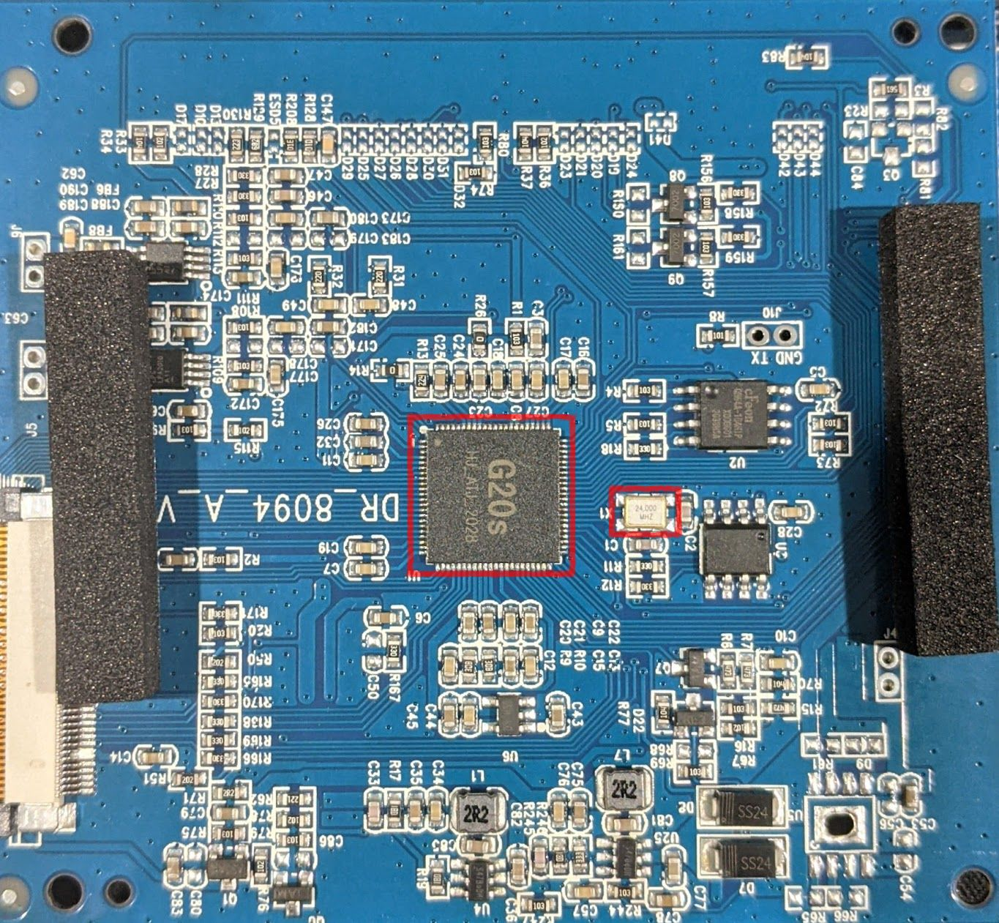
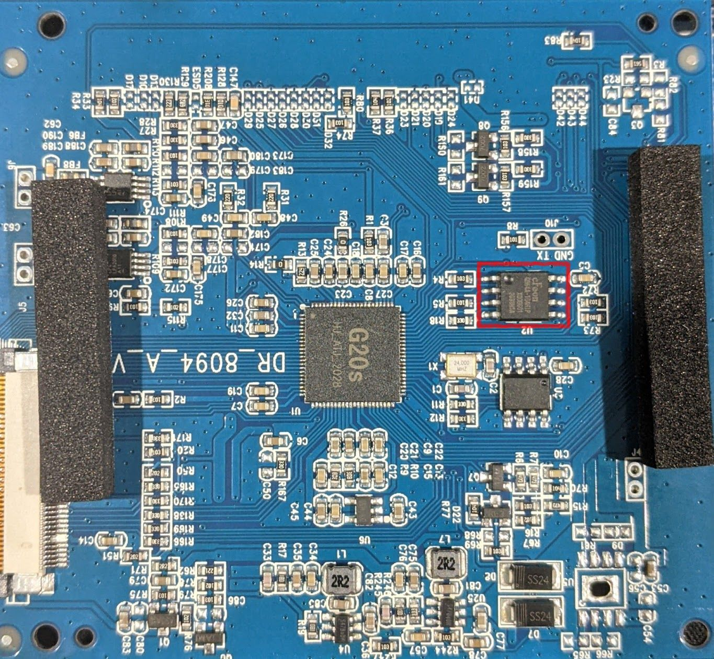
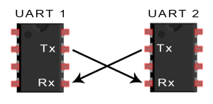
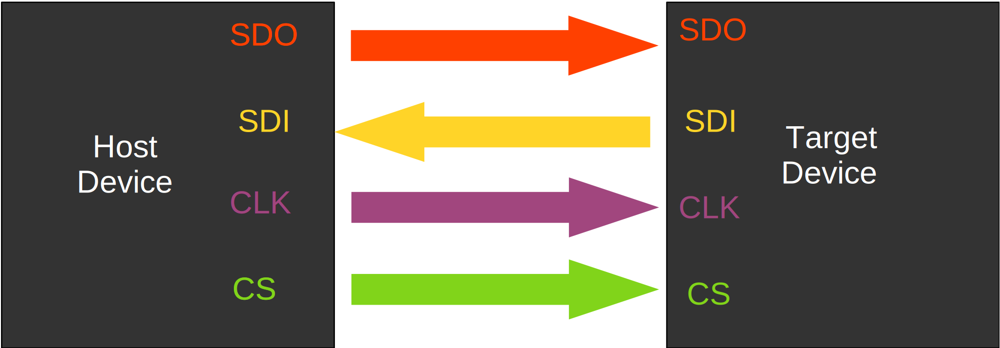
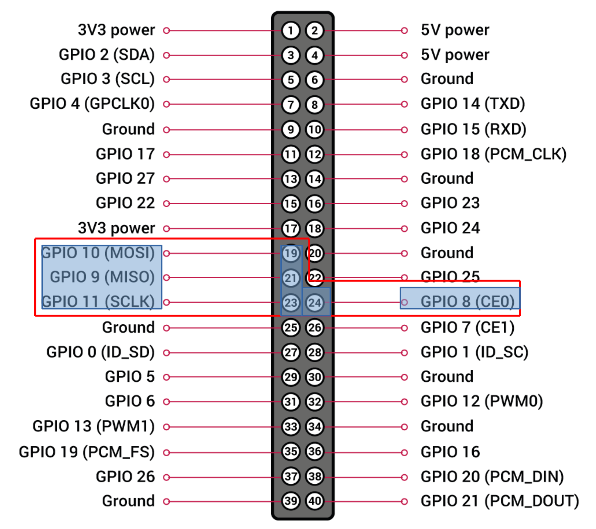
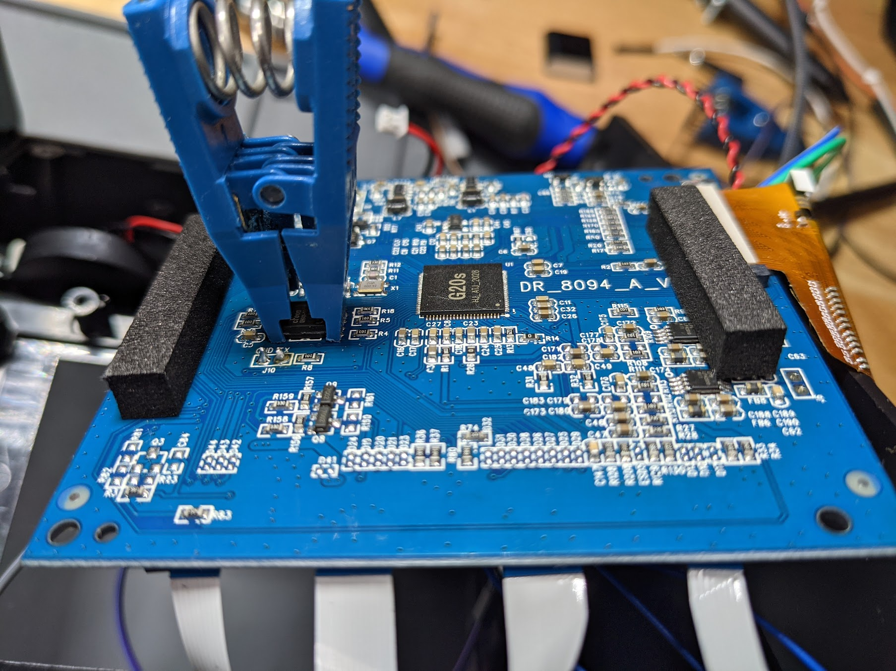
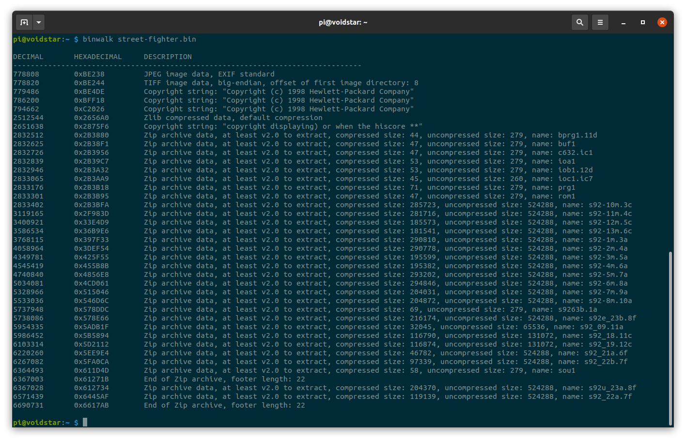
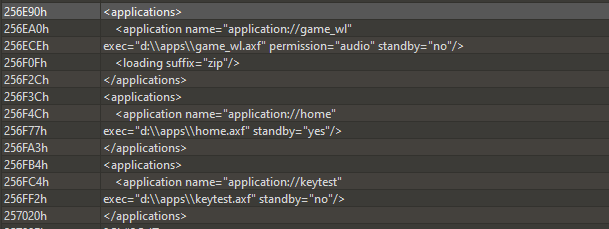
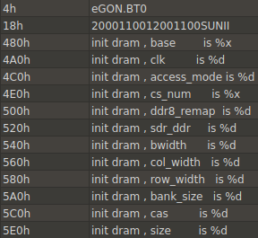

<style>
img[alt~="center"] {
  display: block;
  margin: 0 auto;
}
</style>

# Hacking Hadoukens
## Reverse Engineering a Street Fighter Two Cabinet


---

# Table of Contents
- Introduction
- Platform Overview / Goals
- Hardware Teardown
- Firmware Extraction
- Firmware Analysis
- Conclusion

---

# Introduction

- ```whoami?```
    - Matthew Alt
    - [@wrongbaud](https://twitter.com/wrongbaud)

- Security researcher for Caesar Creek Software
    - Previously @ MIT Lincoln Laboratory, Revo Technik/STASIS Engineering
    - Recovering ECU tuner

- Offer private trainings/consulting through [VoidStar Security LLC](https://voidstarsec.com)

---

# Presentation Goals

1. Explain how to perform black box analysis of embedded systems
2. Learn how to extract SPI flash memory
3. Review initial steps to take when looking at firmware binaries 
4. Review UART/SPI protocols and the tools to interface with them
5. Parse a custom filesystem image with Kaitai Struct

---

# Platform Overview


- Street Fighter 2 Championship Edition Arcade Cab
    - Developed by "My Arcade"
- Allows for two player co-op
- 6 button layout + coin insert buttons
    - Perfect for generic MAME

---

# Research Goals

1. Extract all non-volatile storage
2. Perform cursory analysis of firmware
    - Operating System
    - Application structure
3. Determine if it's possible to run custom programs on the target
4. Overwrite the SFII ROM with a different ROM

---

# Hardware Overview: Interfaces

- When reviewing an embedded system, it is important to review it's external interfaces
- The SF2 cabinet has the following externally exposed interfaces:
  - USB (Charging)
  - Serial (via 3.5mm adio connector) for multiplayer
- This does not leave us with an large attack surface, so we will perform a hardware teardown

---

# Hardware Overview: Goals

- What are we looking for when we perform a hardware teardown?
  - Processors
  - Non-volatile flash devices
  - Debug interfaces
  - Silkscreen or other information labeled on the PCB
- When performing a hardware teardown, be sure to write down / document part numbers for components!
  - _Sometimes_ you can find datasheets

---
<style scoped>
section {
  padding-top: 110px;
}
h1 {
  position: absolute;
  left: 80px;
  top: 70px;
  right: 80px;
  height: 70px;
  line-height: 70px;
}
p {
  position: absolute;
  left: 80px;
  top: 540px;
  right: 80px;
  height: 70px;
  line-height: 70px;
}
</style>

# Hardware Teardown


<p align="center">
This target consists of two main PCBs that we will review
</p>

---
<style scoped>
section {
  padding-top: 110px;
}
h1 {
  position: absolute;
  left: 80px;
  top: 70px;
  right: 80px;
  height: 70px;
  line-height: 70px;
}
p {
  position: absolute;
  left: 80px;
  top: 540px;
  right: 80px;
  height: 70px;
  line-height: 70px;
}
</style>

# Hardware Teardown


- This is our main PCB which contains most of our components of interest

---
<style scoped>
section {
  padding-top: 110px;
}
h1 {
  position: absolute;
  left: 80px;
  top: 70px;
  right: 80px;
  height: 70px;
  line-height: 70px;
}
p {
  position: absolute;
  left: 80px;
  top: 540px;
  right: 80px;
  height: 70px;
  line-height: 70px;
}
</style>

# Hardware Teardown

## CPU / Processors


- The first components that stands out is likely the CPU
- The following characteristics indicate that this is a CPU
  - Central board location
  - Oscillator connected to it
  - All traces lead to it

---
<style scoped>
section {
  padding-top: 110px;
}
h1 {
  position: absolute;
  left: 80px;
  top: 70px;
  right: 80px;
  height: 70px;
  line-height: 70px;
}
p {
  position: absolute;
  left: 80px;
  top: 540px;
  right: 80px;
  height: 70px;
  line-height: 70px;
}
</style>

# Hardware Teardown

## Debug Headers


- These vias are sometimes indicative of debug headers
- Note that one is silk screened ```GND/TX```

---
<style scoped>
section {
  padding-top: 110px;
}
h1 {
  position: absolute;
  left: 80px;
  top: 70px;
  right: 80px;
  height: 70px;
  line-height: 70px;
}
p {
  position: absolute;
  left: 80px;
  top: 540px;
  right: 80px;
  height: 70px;
  line-height: 70px;
}
</style>

# Hardware Teardown
## SPI Flash

- The highlighted component is a SPI flash chip
- This is likely where our data is stored!
- Part number: ```EN25QH64```

---

<style scoped>
section {
  padding-top: 110px;
}
h1 {
  position: absolute;
  left: 80px;
  top: 70px;
  right: 80px;
  height: 70px;
  line-height: 70px;
}
p {
  position: absolute;
  left: 80px;
  top: 540px;
  right: 80px;
  height: 70px;
  line-height: 70px;
}
</style>

# Hardware Teardown
## USB / Serial Connections


- This smaller board houses the USB connector and 3.5mm connector
- ```TX```/```RX```/```DET``` are used for multiplayer purposes, not debugging :(

---

<style scoped>
section {
  padding-top: 110px;
}
h1 {
  position: absolute;
  left: 80px;
  top: 70px;
  right: 80px;
  height: 70px;
  line-height: 70px;
}
p {
  position: absolute;
  left: 80px;
  top: 540px;
  right: 80px;
  height: 70px;
  line-height: 70px;
}
</style>

# Hardware Teardown
## Main Board Bottom Side


- There are not many components on the underside of the PCB
- The silk screen gives us more information about the test pads
  - IO lines for buttons
  - FPC connector for USB/3.5mm PCB 

---

# Hardware Teardown: Component Overview

- Based on our hardware teardown, we now know:
  - Utilizes on G20 ARM
  - Contains a SPI flash chip
  - Has a potential debug header (```GND```/```TX```)
- Next we will examine our two potential interfaces
  - UART
  - SPI

---

# UART: Overview

- UART = Universal Asynchronous Receiver Transmitter
    - Asynchronous = no external clock
    - Often referred to simply as “serial”

- Used to transmit and receive serial data between two components

- Utilizes two lines, Tx and Rx
    - Tx = Transmit
    - Rx = Receive
  


---

# UART: Pi Interfacing
- ```TXD0/IO14``` = Transmit
- ```RXD0/IO15``` = Receive
- Can be accessed via ```/dev/ttyS0```


---

# UART Tools: ```screen```/```minicom```

- The Unix tool screen can be used to access serial ports
  - ```screen /path/to/device baudrate```
  - Exit by pressing ```Ctrl-a``` then ```k```
- ```minicom``` can also be used to interact with serial ports and provides
additional features
  - ```sudo minicom -b baudrate /path/to/device```
  - Allows more complex settings to be saved in a config file

---

# SF2: UART Access


- We will connect to the cabinet's serial debug header with a baudrate of ```115200```
- ```sudo screen /dev/ttyS0 115200```

---

# SF2: UART Access

```
BOOT0 is starting
init dram , base        is 0x80000000
init dram , clk         is 156
init dram , access_mode is 1
init dram , cs_num      is 0x55000001
init dram , ddr8_remap  is 0
init dram , sdr_ddr     is 1
init dram , bwidth      is 16
init dram , col_width   is 10
init dram , row_width   is 13
init dram , bank_size   is 4
init dram , cas         is 3
init dram , size        is 120
dram init successed,size is 64
jump to BOOT1
port:1, port_num:3, func:5 pull:1
port:5, port_num:8, func:3 pull:0
DBG: boot1 starting!
DBG: init key OK
before check_key_to_fel.
===	key_type =1    ===
port0:1
port_num0:0
key_value:0
not times up, not jump to fel.
port:3, port_num:1, func:2 pull:1
port:3, port_num:0, func:2 pull:1
port:3, port_num:3, func:2 pull:1
port:3, port_num:2, func:2 pull:1
value=0
jump to kernal
port:3, port_num:1, func:2 pull:1
port:3, port_num:0, func:2 pull:1
port:3, port_num:3, func:2 pull:1
port:3, port_num:2, func:2 pull:1
EPOS_MEM_DBG ON?, log_mem:0x0
```
---

# SF2 UART Access

- The debug logs for this device are very verbose
  - Over 14kb of data!
- While the information is useful, we are not given a shell or any other kind of access
  - This is still useful for debugging
- Some interesting strings appear in the logfile:
  - ```EPOS_MEM_DBG ON?, log_mem:0x0```
  - ```fba_open:d:\game\sf2ceua.zip```
  - ```read hiscore file, szFilename:e:\sf2ceua.hi, fp:-1037855776```

---

# SF2: UART Access Conclusion
- With this UART we can get access to debug logs
  - There is no ```Rx``` line, so we can only receive data from the target
- The debug logs tell us the following:
  - The EPOS RTOS is likely being used
  - The SF2 ROM is likely a standard MAME ROM
- The application being used is [FB Alpha](https://github.com/barry65536/FBAlpha)
  - ```FB Alpha``` is an [arcade emulator!](https://www.fbalpha.com/)
- To learn more, we will need to try to dump the flash

---

# SPI Flash Extraction

- We have identified the component which likely holds our data
    - ```EN25QH64```
- SPI flash chips can be extracted in circuit (without removing them)
    - We will use a Raspberry Pi for this

---

# Serial Peripheral Interface

- SPI is a synchronous serial communications interface
  - Commonly used for external sensors, SPI flash, etc
- SPI is operated in a full duplex mode
  - This means that both lines can be used at once
- It requires 4 lines to be implemented
  - ```CS```/```CLK```/```SDI```/```SDO```
- The protocol utilizes a host/target paradigm

---

# SPI: Pin Usage / Definition

| Pin | Usage | 
| --- | ----- | 
| Chip Select (CS) | Used to select the appropriate device on the SPI bus that the host wishes to communicate with | 
| Clock (CLK) | Clock signal that is host generated; data is sampled based on the configured SPI mode | 
| Serial Data Out (SDO/MOSI) | Used to send data to the target device from the host, commands are issued through this line |
| Serial Data In (SDI/MISO) | Responses from the target device are sent over this line | 

---

# SPI Connections

<style scoped>
section {
  padding-top: 110px;
}
h1 {
  position: absolute;
  left: 80px;
  top: 70px;
  right: 80px;
  height: 70px;
  line-height: 70px;
}
p {
  position: absolute;
  left: 80px;
  top: 540px;
  right: 80px;
  height: 70px;
  line-height: 70px;
}
</style>




<p align="center">
The host controls the <b>CS</b>, <b>CLK</b> and <b>SDO</b> lines. The target responds on the <b>SDI</b> line
</p>

---

# SPI: Pi Interfacing

- ```IO10/SDO```
- ```IO9/SDI```
- ```IO11/SCLK```
- ```IO8/CS```



---

# SPI Tools: ```flashrom```

- Flashrom is an open source utility that can be used to read and write SPI flash memory
  - Many chips and targets are supported
  - Adding additional chips is straightforward
- Flashrom can be run from the Raspberry Pi!
  - Check out the man pages: man flashrom

---

# SPI Tools: ```flashrom```

- Flashrom can interract with multiple hardware devices, referred to as "programmers"
  - FT2232h (FTDI)
  - Linux SPI Peripherals (Like the one on the Pi!)
  - [More are listed in the documentation](https://flashrom.org/Supported_programmers)
- The programmer is specified with the ```-p``` argument 

---

# SPI Tools: ```flashrom```
## Programmer Selection

- An example programmer argument can be seen below:
  - ```-p linux_spi:dev=/dev/spidev0.0,spispeed=800```
- ```linux_spi``` 
  - Linux based spi subsystem is to be used
- ```dev=/dev/spidev0.0``` 
  - Path to SPI device
- ```spispeed=800```
  - Clock speed to be used (in Khz)

---

# SPI Flash Extraction:

<style scoped>
h1 {
  position: absolute;
  left: 80px;
  top: 20px;
  right: 80px;
  height: 70px;
  line-height: 70px;
}
p {
  position: absolute;
  left: 80px;
  top: 600px;
  right: 80px;
  height: 70px;
  line-height: 30px;
}
</style>





---

# SPI Flash Extraction


| Raspberry Pi GPIO | TSOP8 Clip | 
| ------ | ------------------ |
| CE0 / IO8 | 1| 
| SDI/IO9 | 2 | 
| GND | 4 | 
| SDO/IO10 | 5 | 
| CLK/IO11 |6 | 
| 3V3 | 8 | 

---


<style scoped>
h1 {
  position: absolute;
  left: 80px;
  top: 20px;
  right: 80px;
  height: 70px;
  line-height: 70px;
}
p {
  position: absolute;
  left: 80px;
  top: 600px;
  right: 80px;
  height: 70px;
  line-height: 30px;
}
</style>

# SPI Flash Extraction


<p align="center">
Flashrom was able to dump the SPI flash memory, both dumps have the same <code>md5sum</code> result
</p>

---

# SPI Flash: Initial Analysis

<style scoped>
h1 {
  position: absolute;
  left: 80px;
  top: 20px;
  right: 80px;
  height: 70px;
  line-height: 70px;
}
p {
  position: absolute;
  left: 80px;
  top: 600px;
  right: 80px;
  height: 40px;
  line-height: 30px;
}
</style>




<p align="center">
After extracting the firmware, we will use <code>binwalk</code>/<code>strings</code> on the resulting image
</p>

---

# SPI FLash: Binwalk Output

```
DECIMAL       HEXADECIMAL     DESCRIPTION
--------------------------------------------------------------------------------
778808        0xBE238         JPEG image data, EXIF standard
778820        0xBE244         TIFF image data, big-endian, offset of first image directory: 8
779486        0xBE4DE         Copyright string: "Copyright (c) 1998 Hewlett-Packard Company"
786200        0xBFF18         Copyright string: "Copyright (c) 1998 Hewlett-Packard Company"
794662        0xC2026         Copyright string: "Copyright (c) 1998 Hewlett-Packard Company"
2512544       0x2656A0        Zlib compressed data, default compression
2651638       0x2875F6        Copyright string: "copyright displaying) or when the hiscore **"
2832512       0x2B3880        Zip archive data, at least v2.0 to extract, compressed size: 44, uncompressed size: 279, name: bprg1.11d
2832625       0x2B38F1        Zip archive data, at least v2.0 to extract, compressed size: 47, uncompressed size: 279, name: buf1
2832726       0x2B3956        Zip archive data, at least v2.0 to extract, compressed size: 47, uncompressed size: 279, name: c632.ic1
2832839       0x2B39C7        Zip archive data, at least v2.0 to extract, compressed size: 53, uncompressed size: 279, name: ioa1
2832946       0x2B3A32        Zip archive data, at least v2.0 to extract, compressed size: 53, uncompressed size: 279, name: iob1.12d
2833065       0x2B3AA9        Zip archive data, at least v2.0 to extract, compressed size: 45, uncompressed size: 260, name: ioc1.ic7
2833176       0x2B3B18        Zip archive data, at least v2.0 to extract, compressed size: 71, uncompressed size: 279, name: prg1
2833301       0x2B3B95        Zip archive data, at least v2.0 to extract, compressed size: 47, uncompressed size: 279, name: rom1
2833402       0x2B3BFA        Zip archive data, at least v2.0 to extract, compressed size: 285723, uncompressed size: 524288, name: s92-10m.3c
3119165       0x2F983D        Zip archive data, at least v2.0 to extract, compressed size: 281716, uncompressed size: 524288, name: s92-11m.4c
3400921       0x33E4D9        Zip archive data, at least v2.0 to extract, compressed size: 185573, uncompressed size: 524288, name: s92-12m.5c
3586534       0x36B9E6        Zip archive data, at least v2.0 to extract, compressed size: 181541, uncompressed size: 524288, name: s92-13m.6c
3768115       0x397F33        Zip archive data, at least v2.0 to extract, compressed size: 290810, uncompressed size: 524288, name: s92-1m.3a
4058964       0x3DEF54        Zip archive data, at least v2.0 to extract, compressed size: 290778, uncompressed size: 524288, name: s92-2m.4a
4349781       0x425F55        Zip archive data, at least v2.0 to extract, compressed size: 195599, uncompressed size: 524288, name: s92-3m.5a
4545419       0x455B8B        Zip archive data, at least v2.0 to extract, compressed size: 195382, uncompressed size: 524288, name: s92-4m.6a
4740840       0x4856E8        Zip archive data, at least v2.0 to extract, compressed size: 293202, uncompressed size: 524288, name: s92-5m.7a
5034081       0x4CD061        Zip archive data, at least v2.0 to extract, compressed size: 294846, uncompressed size: 524288, name: s92-6m.8a
5328966       0x515046        Zip archive data, at least v2.0 to extract, compressed size: 204031, uncompressed size: 524288, name: s92-7m.9a
5533036       0x546D6C        Zip archive data, at least v2.0 to extract, compressed size: 204872, uncompressed size: 524288, name: s92-8m.10a
5737948       0x578DDC        Zip archive data, at least v2.0 to extract, compressed size: 69, uncompressed size: 279, name: s9263b.1a
5738086       0x578E66        Zip archive data, at least v2.0 to extract, compressed size: 216174, uncompressed size: 524288, name: s92e_23b.8f
5954335       0x5ADB1F        Zip archive data, at least v2.0 to extract, compressed size: 32045, uncompressed size: 65536, name: s92_09.11a
5986452       0x5B5894        Zip archive data, at least v2.0 to extract, compressed size: 116790, uncompressed size: 131072, name: s92_18.11c
6103314       0x5D2112        Zip archive data, at least v2.0 to extract, compressed size: 116874, uncompressed size: 131072, name: s92_19.12c
6220260       0x5EE9E4        Zip archive data, at least v2.0 to extract, compressed size: 46782, uncompressed size: 524288, name: s92_21a.6f
6267082       0x5FA0CA        Zip archive data, at least v2.0 to extract, compressed size: 97339, uncompressed size: 524288, name: s92_22b.7f
6364493       0x611D4D        Zip archive data, at least v2.0 to extract, compressed size: 58, uncompressed size: 279, name: sou1
6367003       0x61271B        End of Zip archive, footer length: 22
6367028       0x612734        Zip archive data, at least v2.0 to extract, compressed size: 204370, uncompressed size: 524288, name: s92u_23a.8f
6571439       0x6445AF        Zip archive data, at least v2.0 to extract, compressed size: 119139, uncompressed size: 524288, name: s92_22a.7f
6690731       0x6617AB        End of Zip archive, footer length: 22
```
---

# SPI Flash: Initial Analysis

<style scoped>
h1 {
  position: absolute;
  left: 80px;
  top: 70px;
  right: 80px;
  height: 70px;
  line-height: 70px;
}
p {
  position: absolute;
  left: 80px;
  top: 600px;
  right: 80px;
  height: 40px;
  line-height: 30px;
}
</style>




<p align="center">
Examining the strings in the binary showed some plaintext data
</p>

---

# RE Tips: Firmware Blob Analysis

- In addition to running ```binwalk``` and ```strings```, examine the beginning of the file for header information
  - ```hexdump -C -n512 file.bin```
- When examining firmware headers look for:
  - Start addresses (```0x80000000```, etc)
  - Branch instructions (architecture dependent)
  - Size fields / possible checksums

---


# SPI Flash Analysis

```
pi@voidstar:~ $ hexdump -n512 -C street-fighter.bin 
00000000  a8 00 00 ea 65 47 4f 4e  2e 42 54 30 0d 0c 66 fc  |....eGON.BT0..f.|
00000010  00 3a 00 00 30 00 00 00  32 30 30 30 31 31 30 30  |.:..0...20001100|
00000020  31 32 30 30 31 31 30 30  53 55 4e 49 49 00 00 00  |12001100SUNII...|
00000030  78 02 00 00 31 32 30 30  00 00 00 80 78 00 00 00  |x...1200....x...|
00000040  9c 00 00 00 01 00 00 00  01 00 00 55 00 00 00 00  |...........U....|
00000050  01 00 00 00 10 00 00 00  0a 00 00 00 0d 00 00 00  |................|
00000060  04 00 00 00 03 00 00 00  01 00 00 00 01 03 05 01  |................|
00000070  01 ff 00 00 00 00 00 00  00 00 00 00 01 00 00 00  |................|
00000080  06 00 03 01 01 ff 00 00  06 05 03 01 01 ff 00 00  |................|
00000090  06 03 03 01 01 ff 00 00  06 01 03 01 01 ff 00 00  |................|
000000a0  00 00 00 00 00 00 00 00  03 01 02 01 01 01 00 00  |................|
000000b0  03 00 02 01 01 01 00 00  03 03 02 01 01 01 00 00  |................|
000000c0  03 02 02 01 01 01 00 00  00 00 00 00 00 00 00 00  |................|
000000d0  00 00 00 00 00 00 00 00  00 00 00 00 00 00 00 00  |................|
```
<p align="center">
Examining the first 512 bytes of the file reveal what look like a header, googling these strings leads us to the <a href="https://linux-sunxi.org/FEL">Sunxi FEL Webpage</a>
<p>

---

# SPI Flash Analysis

```
pi@voidstar:~ $ hexdump -n512 -C street-fighter.bin 
00000000  a8 00 00 ea 65 47 4f 4e  2e 42 54 30 0d 0c 66 fc  |....eGON.BT0..f.|
```
<p align="center">
The first byte sequence - <code>a8 00 00 ea</code> is an ARM branch instruction!
<p>

---

# SPI Flash Analysis

- Now that the SPI flash has been extracted, we will attempt to understand the boot process
  - How many stages are there in the boot process?
  - Are there any stages that we can interrupt?
- We also need to answer the following questions:
  - What OS is in use? (if any)
  - What filesystem(s) are used?

---

# SPI Flash Analysis


- Here we see some debug strings 
  - Are these present in our serial logs?

---

# Understanding the Boot Process


```
BOOT0 is starting 
init dram , base        is 0x80000000 
init dram , clk         is 156 
init dram , access_mode is 1 
init dram , cs_num      is 0x55000001 
init dram , ddr8_remap  is 0 
init dram , sdr_ddr     is 1 
init dram , bwidth      is 16 
init dram , col_width   is 10 
init dram , row_width   is 13 
init dram , bank_size   is 4 
init dram , cas         is 3 
init dram , size        is 120 
dram init successed,size is 64 
jump to BOOT1 
DBG: boot1 starting! 
DBG: init key OK 
before check_key_to_fel. 
```

---

# Understanding the Boot Process

- After further analysis of the flash, there are two possible boot images:
  - ```eGON.BT0``` at address ```0```
  - ```eGON.BT1``` at address ```0x6000```
- In both boot images, there are references to jump to ```fel```
- After researching ```FEL``` we find the following on the [Allwinner website](https://linux-sunxi.org/FEL)

```
FEL is a low-level subroutine contained in the BootROM on Allwinner devices. It is used for initial programming and recovery of devices using USB. 
```

---

# Understanding FEL Mode

- FEL is a low-level subroutine contained in the BootROM on Allwinner devices.
  - It is used for initial programming and recovery of devices using USB.
- Devices must enter ```FEL``` mode, causing them to present themselves as a USB device
  - ```FEL``` mode is entered by holding certain IO lines on boot
- **If** this mode is present on our cabinet, how might we trigger it? 

---

# Understanding FEL Mode

- After testing, it was discovered that holding volume down during startup causes ```FEL``` mode to be entered

```
[129080.108765] usb 1-1.1: new full-speed USB device number 16 using xhci_hcd
[129080.251695] usb 1-1.1: New USB device found, idVendor=1f3a, idProduct=efe8, bcdDevice= 2.b3
[129080.251718] usb 1-1.1: New USB device strings: Mfr=0, Product=0, SerialNumber=0
```

---

# SPI Flash: Analysis

- Based on our initial analysis of the SPI flash we know the following:
  - There is a two stage bootloader
  - ```FEL``` mode can be entered on startup
  - The CPU is an Allwinner Series CPU
  - FB Alpha Emulation software is in use
  - The SF2 ROM in use is likely a standard one
    - It matches the same structure as the typical MAME ROM

---

# Using FEL Mode

- We can enter ```FEL``` mode, causing the cabinet to present itself as a USB device
  - What can we do with this?

```
before check_key_to_fel. 
===     key_type =1    === 
port0:1 
port_num0:0 
key_value:0 
times up, detect io jump to fel. 
key found, jump to fel
```

---
# Using FEL Mode

- In order to communciate with the device in ```FEL``` mode, we need to build the ```sunxi-tools```
- After building this software, the ```FEL``` version can be queried as shown below:

```
pi@voidstar:~/sf2/sunxi-tools $ sudo ./sunxi-fel version 
Warning: no 'soc_sram_info' data for your SoC (id=1663) 
AWUSBFEX soc=00001663(unknown) 00000001 ver=0001 44 08 scratchpad=00007e00 00000000 00000000
```


---

# Using FEL Mode
- The standard ```FEL``` tools do not have support for our chip ID
- After searching through github using the chip ID [a fork of this repo](https://github.com/Icenowy/sunxi-tools/tree/f1c100s-spiflash) was found that supports our chip!
- What can we **do** with these tools?

---

# Using FEL Mode
- Using the ```fel``` tools we can:
  - Read and write RAM
  - Read and write SPI flash memory
  - Load arbitrary firmware binaries into RAM
```
pi@voidstar:~/remove/projects/sf-cabinet/tools/sunxi-tools $ sudo ./sunxi-fel ver
AWUSBFEX soc=00001663(F1C100s) 00000001 ver=0001 44 08 scratchpad=00007e00 00000000 00000000
pi@voidstar:~/remove/projects/sf-cabinet/tools/sunxi-tools $ sudo ./sunxi-fel spiflash-info
Manufacturer: Unknown (1Ch), model: 70h, size: 8388608 bytes.
pi@voidstar:~/remove/projects/sf-cabinet/tools/sunxi-tools $ sudo ./sunxi-fel spiflash-read 0 0x800000 sf2.bin
```

---

# FEL Mode: Conclusion
- Using FEL mode we can now read and write the SPI flash over USB
- This is much more efficient than using the clips
- This method can also easily be employed by other people for their own testing!
- We still need to answer the following:
  - What OS/RTOS is in use?
  - What filesystem is in use?

---

# Understanding the OS

- Throughout our serial log we see multiple strings such as:
  - ```esMODS_MInstall```  
  - ```esDEV_Plugin```  
  - ```EPOS_MEM_DBG```  
  - ```L560(Esh_shell.c):Esh msg: shell main thread: Bye Bye!```  
- After researching these debug logs, it appears that the OS in use is ePOS v1.0
---

# ePOS v1.0


- Not much information is available on ePOS v1.0
  - https://epos.lisha.ufsc.br/EPOS+Overview
  -  Embedded Parallel Operating System

---

# Understanding the Filesystem

- Based on some strings in the binary, we see references to the following:
  - ```MinFS```
  - ```Fat16```
- A ```Fat16``` header can be found in the image, but the corresponding image doesn't contain anything interesting
- If we search MinFS, interesting table entries can be found

---

# MinFS Tables

- At ROM offset 0x24400, we see the string ```MINFS```

```
2:4400h: 4D 49 4E 46 53 00 00 01 00 02 00 00 BC 01 00 00  MINFS.......¼... 
2:4410h: 4E 00 00 00 88 16 00 00 18 A1 7B 00 00 BC 7B 00  N...ˆ....¡{..¼{. 
```

- What follows this entry is what appears to be a list of files

---

```
2:4600h: bc 03 00 00 f4 02 00 00 00 00 00 00 18 00 01 00  ¼...ô........... 
2:4610h: 04 00 00 00 61 70 70 73 00 1a 00 00 a0 1d 00 00  ....apps.... ... 
2:4620h: a0 1d 00 00 24 00 00 00 0e 00 00 00 61 70 70 5f   ...$.......app_ 
2:4630h: 63 6f 6e 66 69 67 2e 62 69 6e 00 00 a0 37 00 00  config.bin.. 7.. 
2:4640h: 6a 14 00 00 6a 14 00 00 24 00 00 00 0e 00 00 00  j...j...$....... 
2:4650h: 61 70 70 5F 63 6F 6E 66 69 67 2E 66 65 78 00 00  app_config.fex.. 
2:4660h: 18 07 00 00 78 02 00 00 00 00 00 00 18 00 01 00  ....x........... 
2:4670h: 03 00 00 00 64 72 76 00 0C 4C 00 00 48 C6 06 00  ....drv..L..HÆ.. 
2:4680h: 48 C6 06 00 1C 00 00 00 08 00 00 00 65 70 6F 73  HÆ..........epos 
2:4690h: 2E 69 6D 67 90 09 00 00 A0 00 00 00 00 00 00 00  .img... ....... 
2:46A0h: 18 00 01 00 04 00 00 00 67 61 6D 65 54 12 07 00  ........gameT... 
2:46B0h: 50 00 00 00 50 00 00 00 24 00 00 00 0F 00 00 00  P...P...$....... 
2:46C0h: 6B 65 79 5F 52 45 46 2D 4E 65 77 2E 64 61 74 00  key_REF-New.dat. 
2:46D0h: A4 12 07 00 50 00 00 00 50 00 00 00 24 00 00 00  ¤...P...P...$... 
2:46E0h: 0F 00 00 00 6B 65 79 5F 52 45 46 2D 6F 6C 64 2E  ....key_REF-old. 
2:46F0h: 64 61 74 00 F4 12 07 00 50 00 00 00 50 00 00 00  dat.ô...P...P... 
2:4700h: 20 00 00 00 0B 00 00 00 6B 65 79 5F 52 45 46 2E   .......key_REF. 
2:4710h: 64 61 74 00 30 0A 00 00 7C 02 00 00 00 00 00 00  dat.0...|....... 
2:4720h: 18 00 01 00 03 00 00 00 6D 6F 64 00 44 13 07 00  ........mod.D... 
2:4730h: F2 0A 00 00 F2 0A 00 00 20 00 00 00 0B 00 00 00  ò...ò... ....... 
2:4740h: 70 77 6D 5F 63 66 67 2E 69 6E 69 00 38 1E 07 00  pwm_cfg.ini.8... 
2:4750h: 00 80 02 00 00 80 02 00 20 00 00 00 0B 00 00 00  .€...€.. ....... 

```

---

# Analyzying Unknown Headers: Where to Start?

- When looking at an unknown binary format, look for the following:
  - Length fields (before strings etc)
  - Size fields (of entire structure)
  - Pointers / Offset values
- Examining formats like this takes patience
  - Look for a parser if possible
  Google is your friend!

---

# Analyzying Unknown Headers

```
2:4600h: bc 03 00 00 f4 02 00 00 00 00 00 00 18 00 01 00  ¼...ô........... 
2:4610h: 04 00 00 00 61 70 70 73 00 1a 00 00 a0 1d 00 00  ....apps.... ... 
2:4620h: a0 1d 00 00 24 00 00 00 0e 00 00 00 61 70 70 5f   ...$.......app_ 
2:4630h: 63 6f 6e 66 69 67 2e 62 69 6e 00 00 a0 37 00 00  config.bin.. 7.. 
2:4640h: 6a 14 00 00 6a 14 00 00 24 00 00 00 0e 00 00 00  j...j...$....... 

```

<p align=center>
Here is a sample, consisting of multiple file entries
</p>

---

# Analyzying Unknown Headers

```
2:4600h: bc 03 00 00 f4 02 00 00 00 00 00 00 18 00 01 00  ¼...ô........... 
2:4610h: [04] 00 00 00 61 70 70 73 00 1a 00 00 a0 1d 00 00  ....apps.... ... 
2:4620h: a0 1d 00 00 24 00 00 00 [0e] 00 00 00 61 70 70 5f   ...$.......app_ 
2:4630h: 63 6f 6e 66 69 67 2e 62 69 6e 00 00 a0 37 00 00  config.bin.. 7.. 
2:4640h: 6a 14 00 00 6a 14 00 00 24 00 00 00 0e 00 00 00  j...j...$....... 

```

<p align=center>
There is what appears to be a length field for the filename
<br>
<code>apps</code> is 4 bytes
<br>
<code>app_config.bin</code> is 0xE bytes
</p>


---

# Analyzying Unknown Headers

```
2:4600h: bc 03 00 00 f4 02 00 00 00 00 00 00 18 00 01 00  ¼...ô........... 
2:4610h: 04 00 00 00 61 70 70 73 00 [1a] 00 00 a0 1d 00 00  ....apps.... ... 
2:4620h: a0 1d 00 00 24 00 00 00 0e 00 00 00 61 70 70 5f   ...$.......app_ 
2:4630h: 63 6f 6e 66 69 67 2e 62 69 6e 00 00 a0 37 00 00  config.bin.. 7.. 
2:4640h: 6a 14 00 00 6a 14 00 00 24 00 00 00 0e 00 00 00  j...j...$....... 

```

<p align=center>
0x1A is a likely the candidate for a field representing the total length
</p>

---

# Analyzing Unknown Headers

## Examine the Data in 010Editor -- Live analysis!

---

# MinFS Table Entry Structure
<style scoped>
  table{
    margin-left: 300px;
    margin-right: auto;
    font-size: 19px;
    text-align: center;
  }
  </style>

| Element | Size | 
| ------- | ---- | 
| Flash Offset | 4 | 
| Raw Size | 4 | 
| Uncompressed Size | 4 | 
| Entry Length | 2 | 
| Flags | 2 | 
| Name Length | 2 | 
| Extra Length | 2 |
| Name | Name Length | 
| Pad | Entry Length - Name Length - 20 | 

<p align="center">
Now that we understand the format, we need to develop a tool to parse it
</p>

---

# Kaitai Struct


- [Kaitai Struct](https://kaitai.io/) is a binary format analysis tool
  - Declarative language used to define binaru structures
- Free and open source

---

# Kaitai Struct

- Binary formats are defined with a ```.ksy``` file
- Kaitai includes a visualizer to debug your format
- ```.ksy``` files can then be compiled into a language source file
  - Python
  - Javascript
  - C#
- Automatically generates classes for parsing your defined data

---

# Kaitai Struct: Example ```.ksy``` file

<style scoped>
  pre {
    font-size: 16px;
  }
  </style>
```
meta:
  id: gif
  endian: le
seq:
  - id: header
    type: header
  - id: logical_screen
    type: logical_screen
types:
  header:
    seq:
      - id: magic
        contents: 'GIF'
      - id: version
        size: 3
  logical_screen:
    seq:
      - id: image_width
        type: u2
      - id: image_height
        type: u2
      - id: flags
        type: u1
      - id: bg_color_index
        type: u1
      - id: pixel_aspect_ratio
        type: u1
```

---

# Kaitai Struct: Writing a Template

- Templates are written in a ```YAML``` based format
    - [Documentation is here](https://doc.kaitai.io/user_guide.html)
/bin/bash: j:w: command not found
- The ```seq``` element is used to describe the attributes that make up the structure
- Templates can be debugged in the web based editor
    - This can be run locally!

---

# Kaitai Struct: ```.ksy``` Attributes

- ```id``` is used to give the attribute a name
- ```type``` gives the attribute a type
- Common types include:
    - ```u1``` Unsigned Byte
    - ```u2``` Unsigned Word
    - ```s1``` Signed byte
    - ```s2``` Signed Word

---

# Kaitai Struct: ```.ksy``` Substructures

- Types can be defined with the ```types``` element

```
seq:
  - id: track_title
    type: str_with_len
types:
  str_with_len:
    seq:
      - id: len
        type: u4
      - id: value
        type: str
        encoding: UTF-8
        size: len
```

---

# Kaitai Struct: ```.ksy``` Enums

```
seq:
  - id: protocol
    type: u1
    enum: ip_protocol
enums:
  ip_protocol:
    1: icmp
    6: tcp
    17: udp
```

---

# Kaitai Struct: [MinFS Table Header](https://github.com/wrongbaud/sf-cabinet/blob/main/binary-templates/minfs.ksy#L15)

```
  minfs_table_header:
    doc: "Table header for MINFS partition, points to first entry of file table and provides number of total entries"
    seq:
      - id: magic
        contents: [0x4D ,0x49 ,0x4E ,0x46 ,0x53, 0x00]
      - id: version
        type: u2
      - id: tree_offset
        type: u4
      - id: root_size
        type: u4
      - id: tree_entries
        type: u4
      - id: tree_size
        type: u4
      - id: fdata_length
        type: u4
      - id: image_size
        type: u4
```

---

# Kaitai Struct: [MinFS Table Entry](https://github.com/wrongbaud/sf-cabinet/blob/main/binary-templates/minfs.ksy#L34)

```
  minfs_table_entry:
    seq:
      - id: flash_offset
        type: u4
      - id: raw_size
        type: u4
      - id: original_size
        type: u4
      - id: entry_length
        type: u2
      - id: flags
        type: u2
        enum: file_type
      - id: name_length
        type: u2
      - id: extra_length
        type: u2
      - id: name
        type: str
        encoding: UTF-8
        size: name_length
      - id: pad
        size: entry_length - name_length - 20

```

---

# Kaitai Struct: [Final Sequence](https://github.com/wrongbaud/sf-cabinet/blob/main/binary-templates/minfs.ksy#L5)

```
seq:
  - id: minfs_header
    type: minfs_table_header
  - id: minfs_pad
    size: minfs_header.tree_offset-32
  - id: minfs_file_table
    type: minfs_table_entry
    repeat: expr
    repeat-expr: minfs_header.tree_entries
```

---

# Kaitai Struct: Testing the Template


# TODO Screenshot of web viewer

---

# Kaitai Struct: Parsing the Filesystem

- Using Kaitai we can not generate a python library to parse our structure
    - This allows us to easily parse them with the following code:

```
from minfs import *

target = Minfs.from_file("/home/wrongbaud/blog/sf-cabinet/output-files/ramdisk.iso")
os.mkdir("/home/wrongbaud/blog/sf-cabinet/ramdisk/")
for entry in target.minfs_file_table:
    if entry.flags != target.FileType.directory:
        with open(f"/home/wrongbaud/blog/sf-cabinet/ramdisk/{entry.name}",'wb') as ofile:
            ofile.write(entry.file_data)
```

---

# Filesystem Analysis: Examining the Binaries

- After running our script to parse the filesystem, we generate the following files:
```bash
```

---

# Filesystem Analysis: Conclusion

- Using Kaitai we were able to quickly develop a parser for this filesystem
    - This was much easier than manually defining the structs in python!
- With the parser generated by Kaitai, we were able to extract all of the files from the filesystem!
- Next we need to examine our extracted contents

---

# Binary Image Structure 

<style scoped>
  table{
    margin-left: 300px;
    margin-right: center;
    text-align: center;
  }
  th{
    text-align: center;
  }
</style>


| Start Address | Component | 
| ------------- | --------- | 
| 0 | ```BOOT0``` | 
| 0x6000 | ```BOOT1``` | 
| 0x24400 | MINFS Filesystem | 

--- 